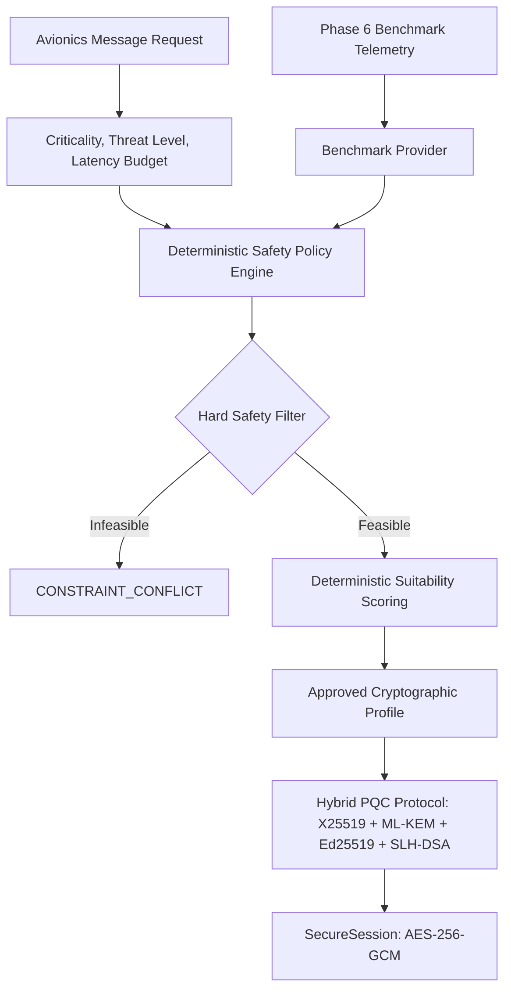
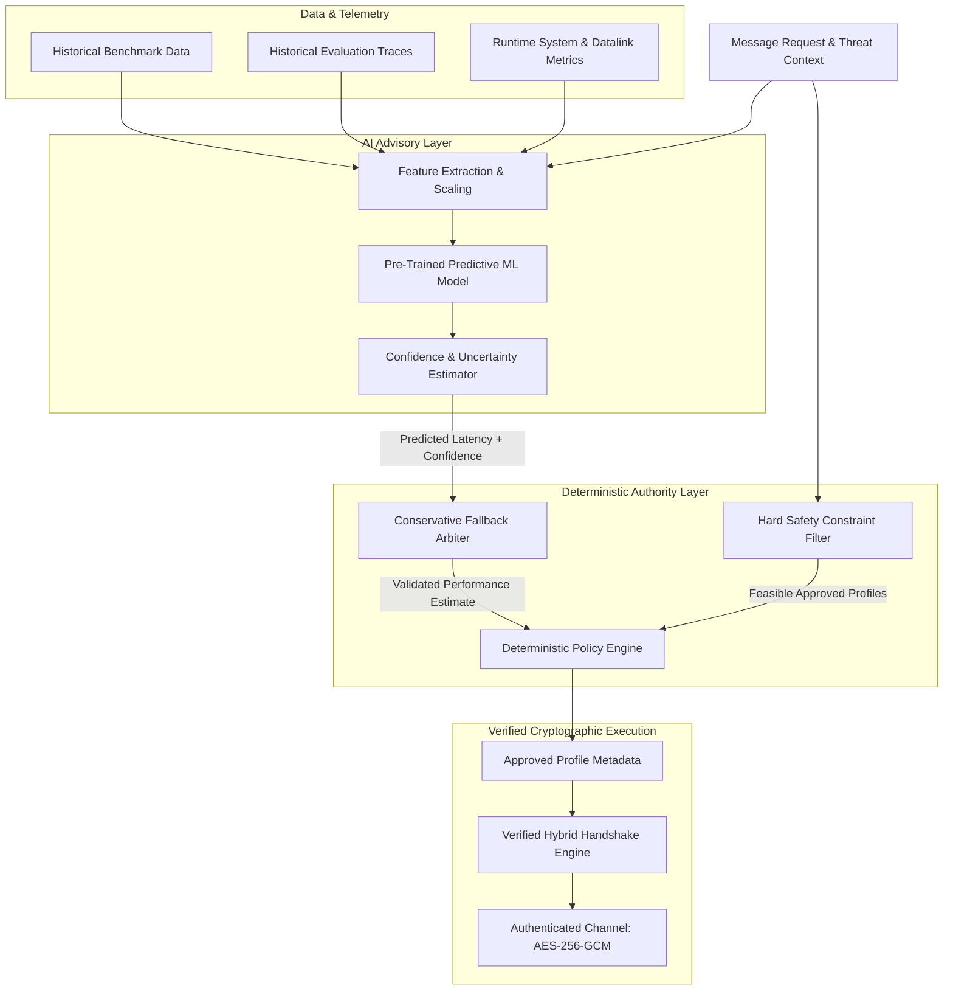
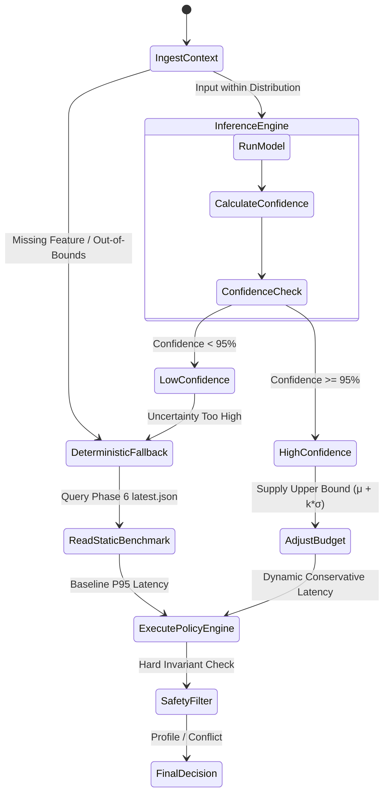

# Future Enhancement Design: AI-Assisted Cryptographic Performance Prediction

> [!IMPORTANT]
> **Status: Architectural Design & Research Specification Only.**
> This document specifies a conceptual future extension. It does not introduce machine learning libraries, alter runtime cryptographic primitives, or modify the verified deterministic policy engine implemented in Phase 9B.

---

## 1. Motivation and Context

In high-integrity aerospace and avionics networks, post-quantum cryptography (PQC) introduces significant computational and communications overhead compared to classical legacy algorithms. As quantified in Phase 6 benchmarks of this project:
- Pure-software stateful/stateless hash-based signatures (e.g., SLH-DSA-SHAKE_128F) incur significant latency (~1.0–1.2s per sign operation on commodity CPU cores).
- Hybrid key encapsulation (X25519 + ML-KEM-1024) and dual authentication expand wire frames from 128 bytes to ~37.5 KB.

While Phase 9B provides a deterministic, explainable safety-constrained policy engine that queries static benchmark measurements (`data/benchmarks/latest.json`), static point estimates cannot anticipate dynamic runtime variance caused by:
1. Variable payload sizes (e.g., telemetry bursts vs. discrete flight-control commands).
2. CPU load, thermal throttling, and context switching on resource-constrained embedded Flight Control Computers (FCC) or Mission Processors.
3. Burst traffic patterns and transient channel interference on untrusted datalinks.

An AI/ML-assisted performance prediction layer can provide fine-grained, context-aware execution time and resource estimations prior to session negotiation. However, in safety-critical avionics, **non-deterministic algorithms must never have authority over security policies or algorithm authorization**. This design articulates an architecture where machine learning acts exclusively as an advisory performance predictor feeding into a deterministic, hard-constrained safety engine.

---

## 2. Current Phase 9B Architecture vs. Proposed AI-Assisted Architecture

### Phase 9B Baseline Architecture (Current Verified System)


### Proposed AI-Assisted Architecture (Future Extension)


### Core Separation of Responsibilities
| System Layer | Functional Role | Determinism | Authority |
| :--- | :--- | :--- | :--- |
| **AI / ML Layer** | Quantitative Latency & Overhead Prediction | Stochastic / Empirical | Advisory Only (No Security Authority) |
| **Safety Filter** | Mandatory Invariant & Downgrade Gate | Pure Deterministic | Absolute Veto |
| **Policy Engine** | Multi-Objective Profile Optimization | Pure Deterministic | Final Decision Authority |
| **Crypto Protocol** | Hybrid Key Agreement & Encryption | Mathematically Proven | Execution Layer |

---

## 3. Predicted Targets and Output Quantities

The predictive model will not output categorical algorithm decisions. It will estimate continuous physical metrics and confidence intervals:

1. **Expected Handshake Latency ($\hat{L}_{\text{handshake}}$):** Predicted end-to-end execution time (in ms) for mutual key exchange (X25519 + ML-KEM-1024) and dual authentication (Ed25519 + SLH-DSA-SHAKE_128F).
2. **Expected Message Processing Latency ($\hat{L}_{\text{msg}}$):** Predicted time (in µs/ms) for serialization, AES-256-GCM authenticated encryption, channel framing, and receiver authentication/decryption as a function of payload size.
3. **Probability of Budget Violation ($P_{\text{violation}}$):** Estimated likelihood that total cryptographic latency exceeds the operational deadline ($L > T_{\text{budget}}$):
   $$P_{\text{violation}} = P(L > T_{\text{budget}} \mid \mathbf{x})$$
4. **Computational & Memory Footprint:** Expected transient heap allocation (KB) and peak CPU utilization during dual signature verification.

---

## 4. Feature Space Design

Features are partitioned into what is **currently available** from Phases 2–9B telemetry versus what **requires future data logging**:

```
Feature Matrix (x)
├── Available in Existing System
│   ├── Message Metadata (Type, Criticality Enum, Payload Size in Bytes)
│   ├── Threat Environment (NORMAL, ELEVATED, HIGH, CRITICAL)
│   ├── Latency Budget (ms)
│   ├── Cryptographic Profile ID & Key Sizes (ML-KEM-1024: 1568B pk, SLH-DSA: 6656B sig)
│   ├── Phase 6 Baseline Metrics (Median ns/µs/ms per primitive)
│   └── System Hardware Specs (CPU architecture, core count, OS platform)
│
└── Requires Future Instrumentation
    ├── Dynamic CPU Load / Core Utilization (%)
    ├── Process Context Switch Frequency
    ├── Datalink Packet Loss Rate (%) & Channel Signal-to-Noise Ratio (SNR)
    ├── Flight Phase (TAXI, TAKEOFF, CLIMB, CRUISE, DESCENT, APPROACH)
    └── Ambient Temperature / Thermal Throttling Status
```

### Tabular Specification of Candidate Features

| Feature Name | Type | Range / Dimension | Source Status | Description |
| :--- | :--- | :--- | :--- | :--- |
| `message_type` | Categorical | `ALTITUDE`, `HEADING`, `STATUS`, `NAV_UPDATE`, `FLIGHT_CONTROL` | **Available Now** | Avionics message functional category |
| `criticality_rank` | Ordinal | `1 (ROUTINE)` to `4 (SAFETY_CRITICAL)` | **Available Now** | Inherent message safety criticality |
| `threat_rank` | Ordinal | `1 (NORMAL)` to `4 (CRITICAL)` | **Available Now** | Simulated operational threat state |
| `payload_bytes` | Continuous | `16` to `65535` bytes | **Available Now** | Plaintext avionics payload size |
| `latency_budget_ms` | Continuous | `1.0` to `10000.0` ms | **Available Now** | Deadline requirement for message delivery |
| `profile_id` | Categorical | `STANDARD_HYBRID`, `HIGH_ASSURANCE_HYBRID` | **Available Now** | Approved candidate operational profile |
| `slhdsa_sign_median_ms` | Continuous | `~1000.0` to `1500.0` ms | **Available Now** | Phase 6 measured baseline for SLH-DSA signing |
| `mlkem_decap_median_ms` | Continuous | `~0.3` to `0.8` ms | **Available Now** | Phase 6 measured baseline for ML-KEM decapsulation |
| `cpu_utilization_pct` | Continuous | `0.0%` to `100.0%` | *Requires Future Collection* | Background processor load |
| `channel_rtt_ms` | Continuous | `0.1` to `500.0` ms | *Requires Future Collection* | Physical link transit latency |

---

## 5. Candidate Machine Learning Models

Given the strict real-time and safety constraints of avionics computing environments, candidate models are evaluated across explainability, sample efficiency, inference latency, and memory footprint.

```
Model Evaluation Trade-Space:
[High Explainability / Low Footprint]                          [High Capacity / High Overhead]
Linear / Ridge Regression  ──►  Decision Trees / Random Forest  ──►  Gradient Boosting (XGBoost/LightGBM)  ──►  Deep Neural Nets (MLP)
```

### Comparative Analysis

| Model Family | Sample Efficiency ($N < 5000$) | Inference Latency | Memory Footprint | Interpretability | Recommended Suitability |
| :--- | :--- | :--- | :--- | :--- | :--- |
| **Ridge / ElasticNet Linear Regression** | **Very High** | $< 5\,\mu\text{s}$ | $< 50\,\text{KB}$ | High (Exact Coefficients) | Baseline comparator only |
| **Random Forest Regressor** | High | $\approx 50\,\mu\text{s}$ | $1–5\,\text{MB}$ | Moderate (Feature Importance) | Suitable |
| **Gradient Boosted Trees (LightGBM / XGBoost)** | **Very High** | **$< 25\,\mu\text{s}$** | **$< 500\,\text{KB}$** | **High (SHAP values / split rules)** | **Primary Recommendation** |
| **Multi-Layer Perceptron (MLP Neural Net)** | Low (prone to overfitting) | $\approx 100–500\,\mu\text{s}$ | $5–20\,\text{MB}$ | Low (Black-box) | Not Recommended |

### Justification for Gradient Boosted Trees (LightGBM / XGBoost)
1. **Small-to-Medium Data Excellence:** Benchmark suites naturally yield $10^3$ to $10^5$ structured tabular samples. Tree ensembles consistently outperform deep networks on structured tabular datasets of this scale.
2. **Deterministic Inference:** Trained decision tree structures compile to simple conditional branches (`if-else` cascades in C or Rust), guaranteeing strict $O(\text{tree\_depth})$ upper bounds on inference latency without GPU or tensor runtime dependencies.
3. **Exact Feature Attribution:** Tree ensembles readily yield TreeSHAP values, providing human-auditable mathematical justifications for why a specific latency value was predicted.

---

## 6. Dataset Schema & Training Pipeline

### Dataset Format (`data/ml/benchmark_dataset.csv`)
The future training dataset must be compiled from real testbed executions without synthetic fabrication:

```csv
experiment_id,timestamp,profile_id,criticality,threat_level,payload_bytes,x25519_ms,mlkem_ms,ed25519_ms,slhdsa_ms,hkdf_ms,aes_gcm_ms,measured_handshake_ms,measured_msg_ms,wire_bytes,cpu_pct,target_total_latency_ms
EXP-0001,2026-09-20T08:00:00Z,HIGH_ASSURANCE_HYBRID,SAFETY_CRITICAL,HIGH,512,0.054,0.397,0.098,1067.74,0.038,0.025,2318.99,0.12,37504,15.2,2319.11
EXP-0002,2026-09-20T08:00:05Z,STANDARD_HYBRID,ROUTINE,NORMAL,64,0.054,0.397,0.098,1067.74,0.038,0.024,2318.99,0.08,37504,12.0,2319.07
```

### End-to-End Training Pipeline Lifecycle
1. **Automated Data Harvesting:** Run parametric benchmark sweeps across message types ($16\text{B} - 4\text{KB}$), simulated threat levels, and CPU stress profiles.
2. **Data Integrity & Outlier Rejection:** Validate monotonic timing bounds; filter system interrupt anomalies using interquartile range (IQR) thresholds.
3. **Stratified Split:** 70% Train, 15% Validation, 15% Holdout Test stratified by `criticality` and `threat_level`.
4. **Loss Function Optimization:** Train with asymmetric Huber loss or Pinball loss to penalize under-prediction of latency more heavily than over-prediction (optimistic latency predictions are dangerous in safety systems).
5. **Model Export & Artifact Locking:** Serialize model to ONNX or flat C header file with cryptographically signed SHA-256 integrity digest.

---

## 7. Uncertainty Quantification and Fallback Architecture

### Conservative Safety Margin Formulation
Predictions must never be treated as exact point truths. Instead, the policy engine consumes an **Upper Prediction Bound ($L_{\text{upper}}$)** at a calibrated confidence level $\alpha$ (e.g., $\alpha = 0.99$):

$$L_{\text{upper}} = \hat{\mu}_{\text{latency}} + k(\alpha) \cdot \hat{\sigma}_{\text{uncertainty}}$$

Where:
- $\hat{\mu}_{\text{latency}}$ is the model's point prediction.
- $\hat{\sigma}_{\text{uncertainty}}$ is estimated via Quantile Regression or ensemble tree variance.
- $k(\alpha)$ is the safety multiplier for the confidence threshold.



### Strict Fallback Triggers
The system unconditionally bypasses the AI layer and defaults to Phase 9B deterministic static benchmarks if any of the following occur:
1. **Model Drift / Out of Distribution (OOD):** Input payload or environmental metrics fall outside the training hyper-cube.
2. **High Prediction Variance:** $\hat{\sigma}_{\text{uncertainty}} > \tau_{\text{variance}}$ (confidence score $< 0.95$).
3. **Execution Timeout:** Inference does not complete within $50\,\mu\text{s}$.
4. **Integrity Check Failure:** Model binary SHA-256 digest fails verification on startup.

---

## 8. Hard Safety Invariants (Non-Bypassable Rules)

The AI layer is logically constrained such that no prediction or error can ever violate core security invariants:

```
[ INVARIANT 1 ]  SAFETY_CRITICAL traffic SHALL ALWAYS mandate MAXIMUM assurance (HIGH_ASSURANCE_HYBRID).
[ INVARIANT 2 ]  CRITICAL / HIGH threat states SHALL NEVER permit classical-only or downgraded profiles.
[ INVARIANT 3 ]  A predicted latency overrun SHALL NEVER trigger an automatic security downgrade.
                 Outcome MUST be CONSTRAINT_CONFLICT.
[ INVARIANT 4 ]  Unapproved or unverified profile IDs are strictly ineligible for selection.
[ INVARIANT 5 ]  AI failure SHALL ALWAYS fail closed to static Phase 6 conservative benchmarks.
```

---

## 9. Conceptual Future API Specification

> *Note: This endpoint is a design specification for future implementation; it is not registered in the active API routes.*

### Endpoint: `POST /api/ml/predict`

#### Request Payload Schema
```json
{
  "message_type": "FLIGHT_CONTROL",
  "criticality": "SAFETY_CRITICAL",
  "threat_level": "HIGH",
  "payload_bytes": 1024,
  "latency_budget_ms": 1500.0,
  "candidate_profile": "HIGH_ASSURANCE_HYBRID"
}
```

#### Response Payload Schema
```json
{
  "prediction_id": "PRED-20260920-88421",
  "status": "VALID",
  "model_version": "xgb-latency-v1.0.4",
  "predicted_mean_ms": 2319.45,
  "predicted_upper_bound_ms": 2450.12,
  "confidence_score": 0.982,
  "budget_violation_probability": 0.994,
  "fallback_engaged": false,
  "fallback_reason": null,
  "feature_attributions": {
    "slhdsa_sign_cost": 0.78,
    "payload_size": 0.14,
    "threat_level": 0.08
  }
}
```

---

## 10. Research Methodology and Comparative Metrics

To validate the academic and engineering merit of the AI-assisted system, future evaluations will measure:

$$\text{Safety Integrity Rate} = \frac{\text{Decisions with Zero Invariant Violations}}{\text{Total Decisions}} \equiv 1.0000 \quad (\text{Mandatory } 100\%)$$

### Comparative Evaluation Matrix

| Metric Category | Metric Name | Baseline (Phase 9B Static) | Future AI-Assisted Target | Research Hypothesis |
| :--- | :--- | :--- | :--- | :--- |
| **Predictive Accuracy** | Latency MAE / RMSE | N/A (Static Point Estimate) | $\text{MAE} < 25\,\text{ms}$ | Contextual sizing improves latency forecasting accuracy |
| **Operational Efficiency** | False Infeasible Rate ($\alpha_{\text{err}}$) | Higher (due to static worst-case bounds) | $\ge 40\%$ Reduction | Accurate predictions prevent unnecessary conflict rejections |
| **Safety Assurance** | Invariant Violations | 0 (Zero) | **0 (Zero)** | Safety constraints remain impervious to prediction errors |
| **Decision Overhead** | Evaluation Time ($\mu\text{s}$) | $\approx 150\,\mu\text{s}$ | $< 250\,\mu\text{s}$ | High-speed inference maintains real-time control feasibility |

---

## 11. Ethical Framing and Research Boundaries

1. **No Algorithmic Invention Claim:** We do not claim invention of novel encryption primitives or neural cryptographic replacements. The contribution is strictly an *advisory operational latency predictor embedded within a hard-safety avionics policy selector*.
2. **Simulation Boundary:** All evaluations reflect controlled software simulations and hardware benchmark suites. They do not constitute FAA/EASA DO-178C or DO-254 certified flight-software claims.
3. **Explainability Requirement:** Black-box neural models without verifiable uncertainty bounds are intentionally excluded from flight-critical operational paths.
